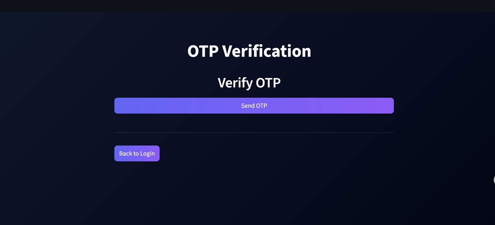
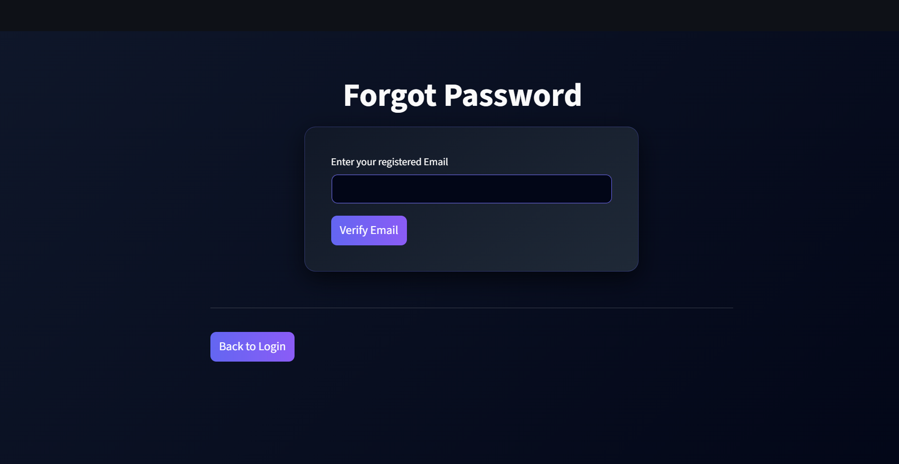

# Milestone 2 – AI Readability Dashboard & Security Enhancements

## Project Title
TextMorph – Advanced Text Summarization and Paraphrasing

## Description

In Milestone 2, we enhanced the existing authentication system by implementing OTP-based login verification, login attempt restriction, and an AI-powered Readability Dashboard.

The application now includes OTP authentication, an account lock mechanism, Admin and Chat pages, and a Readability Dashboard that analyzes text using standard readability metrics.

All features are fully integrated and tested within the TextMorph application.

## Technologies Used

- Streamlit (Frontend UI)
- MongoDB Atlas (Cloud Database) – https://www.mongodb.com/atlas
- HTML & CSS (Custom Styling) – UI customization
- Plotly – Interactive gauge charts
- SMTP (Email OTP System)
- JWT (PyJWT)
- PyPDF2 – PDF text extraction
- Textstat – Readability metrics  
- Python

## Features Implemented

- OTP-based Login Verification  
- Login Attempt Limit (Account Lock Mechanism)  
- Readability Dashboard (Text Readability Analysis with PDF/TXT Support) 
- Admin Dashboard with User Management
- Chat Page  
- Password history check

## Readability Metrics Used

- Flesch Reading Ease  
- Flesch Kincaid Grade Level  
- Gunning Fog Index  
- SMOG Index

## How to Run the Application

1. Install dependencies:

   !pip install pymongo streamlit pyjwt bcrypt python-dotenv pyngrok nltk streamlit-option-menu plotly textstat PyPDF2 -q

2. Ensure required configuration values are added in Streamlit Secrets.

3. Run the application:

4. Click the generated URL to open the application in your browser.

## Screenshots

### Signup Page

### Readability Dashboard

### Admin Dashboard

### Chat Page

### OTP Verification page

### Forgot Password

### Recovery Method

### Security Question Verification

### Login Page

  
